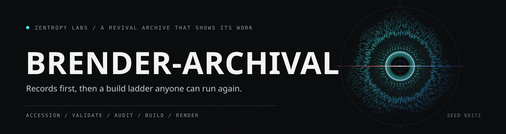
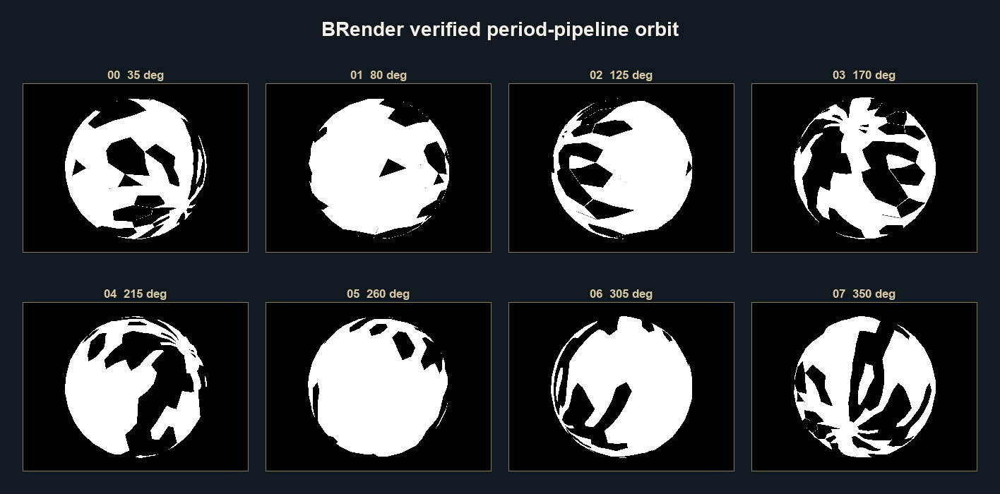
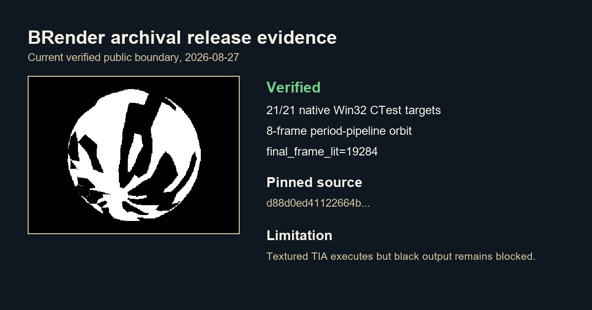
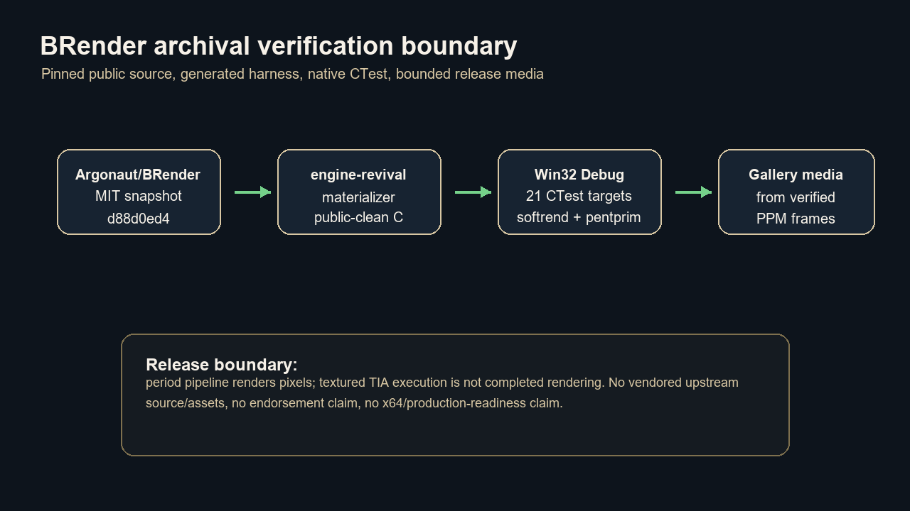

# brender-archival



Reviving Argonaut's BRender, and every other lost rendering and game engine,
one at a time. This is the public revival archive: reproducible harnesses,
verified build ladders, bounded release evidence, and public-safe metadata. It
vendors no proprietary source, no game assets, and no restricted material.

BRender is the current flagship release lane. The rest of the roster remains in
progress.

## BRender: rebuilt and rendering

From the public BRender v1.3.2 source snapshot (MIT, provenance via Foone
Turing, release authorized by former Argonaut CEO Jez San), pinned at commit
`d88d0ed41122664b9781015b517db64353e16f19`, the materializer generates an
out-of-tree CMake harness that references the source checkout in place.

The verified 2026-08-27 boundary is Visual Studio Win32 Debug:

- 21/21 native CTest targets pass.
- The period-pipeline rung compiles softrend and pentprim from the upstream tree
  itself, binds pentprim's primitive library, and drives
  `BrZbSceneRender`.
- The period-pipeline rung renders `dat/sph32.dat` as an eight-frame nonblack
  orbit and reports `final_frame_lit=19284 valid=true` for the release media
  source run.
- Release hardening covers generated-C JSON escaping, caller-owned workfile
  protection, material-resolve third-edge initialization, INDEX_8 palette
  lookup, and removal of stale investigation diagnostics.

The experimental textured TIA path executes, but black output remains blocked by
a measured vertex-layout/state mismatch. This repository does not claim
completed textured rendering, x64 readiness, production readiness, endorsement,
or vendored upstream source/assets.

![Eight stages taking pinned upstream source to a running ladder: pin, materialize, compat, configure, build, ladder, capture, package. One upstream commit of the public BRender v1.3.2 source is named in the record. The materializer writes thirty-one files out of tree, none of them copied from upstream: the CMake project, the compatibility C ports that stand in for the period assembly kernels, and the smoke programs. CMake configures a Visual Studio Win32 target against the named source directory, and the FLOAT core is built from eight upstream directories under nine compile definitions. Twenty-one targets then run under CTest, twenty from the generated project plus the period-pipeline rung that binds softrend and pentprim into one process. Frames and transcripts are captured, and the packager hashes everything it stages. The transcript recorded on the twenty-seventh of August 2026 reports twenty-one of twenty-one passed with none failed. Three outcomes: the ladder renders a nonblack orbit, some assembly kernels remain linkage stubs, and a completed textured period render is not claimed.](docs/art/ladder-lane.svg)

| Rung | What it proves |
|---|---|
| Vector math | scalar and vector core |
| Framework startup | `BrBegin` / `BrEnd` |
| Wireframe | `BrMatrix4Perspective` into a memory pixelmap |
| Scene graph | model actors projected through BRender's v1db transforms |
| Solid shaded | portable C scanline rasterizer, per-face lighting |
| Depth buffer | per-pixel occlusion in the portable rung |
| Textured | perspective-correct texture mapping in the portable rung |
| Datafile models | `BrModelLoad` renders real `.dat` models |
| UV-textured models | loaded model UV coordinates drive texture sampling |
| Multi-part assembly | `BrModelLoadMany` composites the 12-part coupe |
| Gouraud shading | per-vertex normals and smooth gradients |
| Plotter lane | hidden-line-removed SVG polylines, pen-plotter ready |
| Asset audit | loaded model geometry, face indices, degenerate faces, and material attachment |
| Pixelmap audit | `BrPixelmapLoad` probes period `.pix` and `.pal` files |
| Material audit | `BrMaterialLoad` identifiers, flags, index_base, and colour-map attachment |
| Pixelmap round trip | `BrPixelmapSave` then reload, with safe caller-owned workfile handling |
| Material resolve | `BrMaterialLoad` material attached to loaded model faces and rendered |
| File-texture sampling | loaded period `.pix` sampled with palette-aware INDEX_8 lookup |
| Game shell | deterministic INIT/LOAD/RUN/TEARDOWN frame loop over loaded assets |
| Host semantic | host file round trips without deleting preexisting caller-owned workfiles |
| Period pipeline | softrend plus pentprim built from upstream, nonblack ZB sphere output |

## Release media

The current public media is generated from verified nonblack render output or
from factual diagrams/cards. Black diagnostic frames and generative imitation
are excluded. Provenance, commands, dimensions, hashes, input attribution,
metrics, and limitations are recorded in
[gallery/release-20260827/provenance-manifest.json](gallery/release-20260827/provenance-manifest.json).

| | |
|---|---|
|  |  |
|  |  |

The social preview card is
[gallery/release-20260827/social-card-1200x630.png](gallery/release-20260827/social-card-1200x630.png).
The full progress sequence is
[gallery/release-20260827/progress-sequence.png](gallery/release-20260827/progress-sequence.png).

## Gallery

These captures are produced by render smokes from BRender's public sample
models. They are public release output, not vendored upstream assets.

| | |
|---|---|
|  |  |
|  |  |
|  |  |
|  |  |
|  |  |

The plotter lane also emits ready-to-plot SVG:
[gallery/10-teapot-plotter.svg](gallery/10-teapot-plotter.svg).

See [docs/BRENDER-ARCHIVAL.md](docs/BRENDER-ARCHIVAL.md) for the full packet:
provenance, reproduction, current capability, and bounded limitations.

## Package a release

```powershell
python scripts/package_brender_release.py `
  --source-root C:\path\to\BRender-v1.3.2 `
  --output-root C:\path\to\release-stage
```

The packager stages the materialized harness, README, CTest transcripts, current
release media, provenance manifest, `SHA256SUMS.txt`, and
`package-receipt.json`. No proprietary source or assets are copied.

## Reproduce the BRender build

```powershell
python -m pip install -e ".[test]"
engine-revival materialize-brender-harness `
  --source-root C:\path\to\BRender-v1.3.2 `
  --output-root C:\path\to\brender-portable-core-harness
cmake -S <harness> -B <build> -A Win32 "-DBRENDER_SOURCE_DIR=C:\path\to\BRender-v1.3.2"
cmake --build <build> --config Debug
ctest --test-dir <build> -C Debug --output-on-failure
```

`brender_core_model_smoke <model.dat> <out.ppm>` doubles as a minimal viewer for
the period asset library.

## Archive workflow

![Eight stages taking a lead from an empty directory to a published page: seed, record, schema, validate, rights, audit, index, publish. The seed command lays out one directory per record kind, twelve of them, covering targets, artifacts, sources, tasks, milestones, accessions, reproductions, snapshots, readiness, builds, harnesses and attempts. Each finding becomes one JSON file. Twelve schemas name the fields a record of that kind must carry, and the validate command reports any record that omits one. Every artifact carries a redistribution status and an access level, and the audit command refuses the combination of restricted material with a publishable level. The index command renders the twenty-three engine targets as one table, and the report command writes the generated pages out of the corpus. Three hundred and forty-two records sit on disk across the twelve kinds, and the audit returns no messages against them on this checkout. Three outcomes: a public record whose page regenerates from it, a reference held as metadata only, or a holding that is not held at all.](docs/art/archive-lane.svg)

```powershell
python -m pip install -e ".[test]"
engine-revival seed
engine-revival validate
engine-revival audit-public
engine-revival index
engine-revival report
python -m pytest
```

Findings live as structured JSON records first (`readiness/`, `harnesses/`,
`attempts/`, `reproductions/`, `sources/`, `targets/`, ...), and generated pages
under `docs/generated/` are views over that corpus.

![A table of twelve rows: what is in the archive, how many of it there are, and where each number is read from. Twelve record kinds are named in RECORD_DIRS, and three hundred and forty-two JSON records sit across their directories, with sources leading at seventy-eight and artifacts and accessions at sixty each. Twenty-three engine targets span fifteen categories: eight carry curated public sources and fifteen carry curated public metadata. Sixty-two of the seventy-eight sources are rated high confidence and sixteen moderate. Five artifacts are marked do-not-redistribute; four are metadata-only and one is public-reference, so none of them is publishable, and their accessions all record no holding. The audit command returns no messages against the whole corpus. Twelve schemas name the required fields. The report command writes two hundred and fourteen files and leaves the tree byte-identical. The BRender ladder runs twenty-one targets under CTest, the materializer generates thirty-one files, and the FLOAT core is built from eight upstream directories under nine compile definitions. One hundred and twenty-nine Python tests cover the loaders, the reports, the audit, the materializer, the packager, and every number drawn here.](docs/art/corpus-table.svg)

## License

Copyright (C) 2026 Zain Dana Harper. Licensed under the GNU Affero General
Public License v3.0 or later; see [LICENSE](LICENSE). The BRender source this
project revives is separately MIT licensed and is referenced from a public
checkout, never vendored here.

## Public docs

- [Revival mission](docs/REVIVAL-MISSION.md)
- [BRender archival packet](docs/BRENDER-ARCHIVAL.md)
- [Public boundary](docs/PUBLIC-BOUNDARY.md)
- [Recovery workflow](docs/RECOVERY-WORKFLOW.md)
- [Generated public index](docs/generated/index.md)
- [Generated corpus database](docs/generated/database.json)
- [Generated production readiness](docs/generated/production-readiness.md)
- [Generated harnesses](docs/generated/harnesses.md)
- [Generated attempts](docs/generated/attempts.md)
- [Contributing](CONTRIBUTING.md)

---

**[Zentropy Labs](https://github.com/ZentropyLabs-ai)** · order out of entropy.
An independent lab building evidence-first tools that leave a re-checkable
artifact behind. Built by Zain Dana Harper in Seattle. The full workbench is at
[Project Telos](https://harperz9.github.io).
