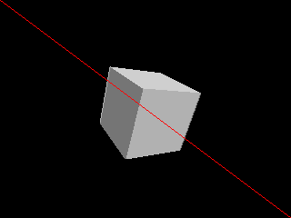
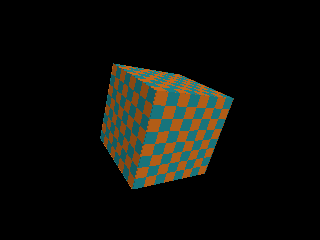
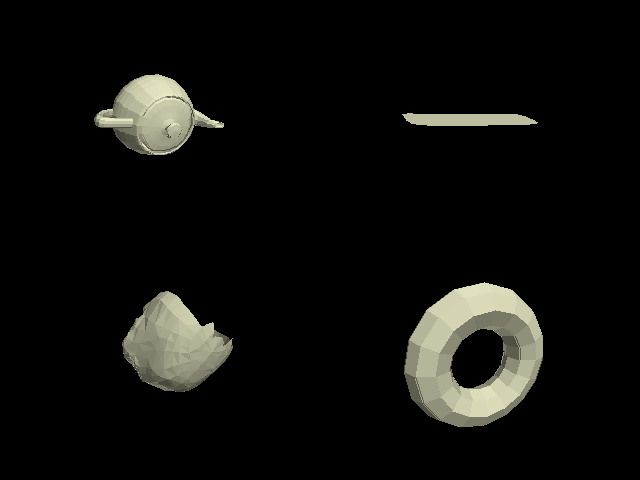

# brender-archival

Reviving Argonaut's BRender, and every other lost rendering and game engine, one
at a time. This is the public revival archive: a reproducible harness, verified
build ladders, and public-safe metadata. It vendors no proprietary source, no
game assets, and no restricted material.

BRender is the completed flagship. The rest of the roster is in progress.

## BRender: rebuilt and rendering

From the public BRender v1.3.2 source (MIT, provenance via Foone Turing, release
authorized by former Argonaut CEO Jez San), pinned at commit `d88d0ed4`, the
materializer generates an out-of-tree CMake harness that builds the FLOAT core
through BRender's own pure-C memory-pixelmap path, with no dependence on the
period 386-assembly software renderer. It stands up a sixteen-target ladder of
self-verifying rungs, all green under CTest on a Visual Studio Win32
target:

| Rung | What it proves |
|---|---|
| Vector math | scalar and vector core |
| Framework startup | `BrBegin` / `BrEnd` |
| Wireframe | `BrMatrix4Perspective` into a memory pixelmap |
| Scene graph | a model out of the v1db database via `BrActorToScreenMatrix4` |
| Solid shaded | portable C scanline rasterizer, per-face lighting |
| Depth buffer | correct per-pixel occlusion |
| Textured | perspective-correct texture mapping |
| Datafile models | `BrModelLoad` renders real `.dat` models |
| UV-textured models | a loaded model textured through its own UV coordinates |
| Multi-part assembly | `BrModelLoadMany` composites the 12-part coupe |
| Gouraud shading | per-vertex normals, smooth gradients (194 grey levels) |
| Plotter lane | hidden-line-removed SVG polylines, pen-plotter ready |
| Asset audit | `BrModelLoad` geometry validation: finite vertices, face index ranges, degenerate faces, face-material attachment; one JSON summary per model |
| Pixelmap audit | `BrPixelmapLoad` decode probe over period `.pix` and `.pal` files (palettes are pixelmap datafiles), reporting type, geometry, and whether pixels decoded |
| Material audit | `BrMaterialLoad` over `std.mat`/`winstd.mat`: identifier, flags, index_base, colour-map attachment |
| Pixelmap round trip | native datafile write path: `BrPixelmapSave` then reload, type and geometry compared, temp file removed on every exit path |

The audit rungs are grounded in the pinned upstream tree at commit `d88d0ed4`:
loader locations (`core/v1db/v1dbfile.c`, `core/pixelmap/pmfile.c`), struct
fields (`br_face.material`, `br_material.identifier/flags/index_base/
colour_map`), and the 68-file `dat/` inventory were all verified from that tree
before the rungs were written.

### Gallery

The captures below are produced by the render smokes from BRender's own public
sample models. They are the release output, not committed build artifacts.

| | |
|---|---|
|  |  |
|  |  |
|  |  |
|  |  |
|  |  |

The datafile frame is the Utah teapot, a skull, a car panel, and a torus, each
loaded straight from its native binary `.dat` datafile and rendered solid and
depth-buffered. The final frame is the plotter lane: the same teapot as a
hidden-line pen-plotter drawing, emitted as ready-to-plot SVG
([gallery/10-teapot-plotter.svg](gallery/10-teapot-plotter.svg)).

See [docs/BRENDER-ARCHIVAL.md](docs/BRENDER-ARCHIVAL.md) for the full packet:
provenance, reproduction, what a developer can do today, and the honestly
deferred items (period softrend assembly, x64, material resolution, packaging).

## Reproduce the BRender build

```powershell
python -m pip install -e ".[test]"
engine-revival materialize-brender-harness `
  --source-root C:\path\to\BRender-v1.3.2 `
  --output-root C:\path\to\brender-portable-core-harness
cmake -S <harness> -B <build> -A Win32 "-DBRENDER_SOURCE_DIR=C:\path\to\BRender-v1.3.2"
cmake --build <build> --config Debug --target brender_core_model_smoke
ctest --test-dir <build> -C Debug --output-on-failure
```

`brender_core_model_smoke <model.dat> <out.ppm>` doubles as a minimal viewer for
the period asset library.

## The archive workflow

```powershell
python -m pip install -e ".[test]"
engine-revival seed
engine-revival validate
engine-revival audit-public
engine-revival index
engine-revival report
python -m pytest
```

Findings live as structured JSON records first (`readiness/`, `harnesses/`,
`attempts/`, `reproductions/`, `sources/`, `targets/`, ...), and the generated
pages under `docs/generated/` are views over that corpus.

## License

Copyright (C) 2026 Zain Dana Harper. Licensed under the GNU Affero General Public
License v3.0 or later; see [LICENSE](LICENSE). The BRender source this project
revives is separately MIT licensed and is referenced from a public checkout,
never vendored here.

## Public Docs

- [Revival mission](docs/REVIVAL-MISSION.md)
- [BRender archival packet](docs/BRENDER-ARCHIVAL.md)
- [Public boundary](docs/PUBLIC-BOUNDARY.md)
- [Recovery workflow](docs/RECOVERY-WORKFLOW.md)
- [Generated public index](docs/generated/index.md)
- [Generated corpus database](docs/generated/database.json)
- [Generated production readiness](docs/generated/production-readiness.md)
- [Generated harnesses](docs/generated/harnesses.md)
- [Generated attempts](docs/generated/attempts.md)
- [Contributing](CONTRIBUTING.md)

---

**[Zentropy Labs](https://github.com/ZentropyLabs-ai)** · order out of entropy. An independent lab building evidence-first tools that leave a re-checkable artifact behind. Built by Zain Dana Harper in Seattle. The full workbench is at [Project Telos](https://harperz9.github.io).
